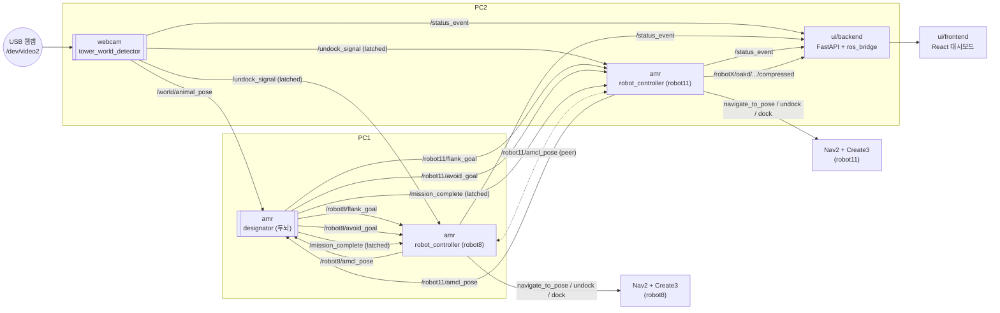

# FarmGuard — 야생동물 몰이 협업 로봇 시스템

관제탑 웹캠으로 침입 동물을 탐지하고, 두 대의 TurtleBot4(Create3)가 호(arc) 플랭킹으로
동물을 게이트 방향으로 몰아낸 뒤 자동으로 도킹 복귀하는 시스템입니다. 웹 UI로 실시간
상태를 관제하고, 사건을 6단계 통합 보고서로 자동 기록합니다.

## 팀 프로젝트 정보

> **본 프로젝트는 팀 프로젝트(FarmGuard)입니다.**

| 항목 | 내용 |
| --- | --- |
| 팀명 | FarmGuard |
| 프로젝트 유형 | 팀 프로젝트 |
| 본인 역할 | 유해 동물 퇴치 알고리즘 설계, SAFE_STOP 안전장치

### 배운 점

어려운 문제일수록 이론만으로는 풀리지 않는다는 것을 느꼈습니다.
`safe_dist` 수치 하나, QoS 설정 하나가 시스템 전체를 멈추는 상황을 반복적으로 겪으면서,
막히면 우회하거나 포기하는 대신 원인을 찾고 직접 부딪혀 해결하는 방식을 몸으로 익혔습니다.
실제 로봇 위에서 돌아가는 코드를 다루며 "작동하는 것"과 "제대로 작동하는 것"이 얼마나 다른지 배웠습니다.

### 발전 방향

동일한 문제를 다시 푼다면 **강화학습(Reinforcement Learning)** 기반 접근을 시도해볼 것입니다.
현재 시스템은 Strömbom 모델을 기반으로 사람이 직접 설계한 규칙(플랭킹 각도, 반경, 히스테리시스 등)으로 동작합니다.
강화학습을 적용하면 이 파라미터들을 시뮬레이션 환경에서 에이전트가 스스로 학습하게 할 수 있고,
단순 goal 추종을 넘어 동물의 도주 패턴 예측, 다중 동물 대응 등 더 복잡한 상황에도 유연하게 대응할 수 있을 것으로 기대합니다.

---

## 목차

- [시연 영상](#시연-영상)
- [시스템 아키텍처](#시스템-아키텍처)
- [리포지토리 구조](#리포지토리-구조)
- [사전 준비물](#사전-준비물)
- [설치 및 실행 (클론 직후)](#설치-및-실행-클론-직후)
- [핵심 알고리즘: 호(Arc) 플랭킹](#핵심-알고리즘-호arc-플랭킹)
- [안전장치](#안전장치)
- [참고 문서](#참고-문서)

## 시연 영상

전체 시스템 동작 시연:


원본 영상(음성 포함, mp4)은 [`images/total.mp4`](images/total.mp4)에서 확인할 수 있습니다.

## 시스템 아키텍처

### 전체 설계도


원본: [`docs/시스템 설계도.png`](docs/시스템%20설계도.png) — 웹캠 감지부터 PC1/PC2 로봇 제어,
Nav2, TurtleBot4 실행 계층, UI까지 전체 기능 흐름을 담은 상세 다이어그램입니다.

### 노드 간 데이터 흐름 (요약)



핵심 설계 원칙은 **판단(designator)과 실행(robot_controller)의 분리**입니다.
- `webcam`(눈): 동물의 map 좌표만 발행. 로봇은 온보드 탐지를 하지 않습니다.
- `designator`(두뇌): 좌표 계산과 우선순위 판단만 하고, 실제 로봇 액션(undock/nav/dock)은 절대 실행하지 않습니다.
- `robot_controller`(손발): goal을 그대로 Nav2에 전달하고 상태머신으로 undock/nav/dock을 수행합니다. goal 계산은 하지 않습니다.

이렇게 나눈 이유는 로봇 1대가 죽어도 나머지 로직(탐지, 판단)이 영향받지 않게 하고,
두 PC에 역할을 분산했을 때 각자 독립적으로 재시작/디버깅할 수 있게 하기 위해서입니다.

## 리포지토리 구조

```text
.
├── src/                        # ROS2 colcon 워크스페이스
│   ├── amr/                    # 로봇 제어 + 미션 코디네이터 패키지 (ament_python)
│   │   └── amr/
│   │       ├── designator.py       # 두뇌: 플랭킹 goal 계산, 좌우 배정, PVO
│   │       └── robot_controller.py # 손발: undock/nav/dock 상태머신 (로봇 1대 전용)
│   └── webcam/                 # 관제탑 인지 패키지 (ament_python)
│       └── webcam/
│           ├── tower_world_detector.py  # YOLO+ByteTrack 탐지 → map 좌표 발행
│           ├── calibrate_homography.py  # 픽셀→map 호모그래피 캘리브레이션 도구
│           ├── best.pt                  # 커스텀 YOLO 가중치
│           └── ground_homography.npy    # 사전 계산된 호모그래피 행렬
├── ui/                          # 웹 관제 대시보드 (colcon 패키지 아님, 별도 빌드체계)
│   ├── frontend/                # React + Vite
│   ├── backend/                 # FastAPI + rclpy 기반 ROS bridge
│   └── docs/                    # UI 아키텍처/ERD 문서
└── docs/                        # 전체 시스템 설계도
```

`ui`가 `src/` 밖, 리포 루트에 있는 이유는 colcon으로 빌드되는 ROS 패키지가 아니라
npm/FastAPI로 별도 실행되는 웹 애플리케이션이기 때문입니다.

## 사전 준비물

| 항목 | 필요 버전/사양 | 비고 |
| --- | --- | --- |
| OS | Ubuntu 22.04 | ROS2 Humble 기준 |
| ROS2 | Humble | `amr`, `webcam` 패키지 빌드/실행에 필수 |
| Nav2, `irobot_create_msgs` | Humble 버전 | TurtleBot4(Create3) 제어에 필요 |
| Python | 3.10 이상 | |
| Node.js / npm | 20 LTS 이상 | UI 프론트엔드 |
| GPU (권장) | CUDA 사용 가능 GPU | YOLO 실시간 추론용. 없으면 `tower_world_detector.py`의 `DEVICE`를 `'cpu'`로 바꿔야 함 |
| 하드웨어 | TurtleBot4 ×2 (robot8, robot11), 관제탑 USB 웹캠 ×1 | |

두 대의 PC가 **같은 네트워크(LAN)** 에 있어야 하고, 두 PC의 `ROS_DOMAIN_ID`가
반드시 동일해야 DDS discovery가 됩니다.

## 설치 및 실행 (클론 직후)

이 프로젝트는 **PC1(designator + robot8 제어)** 와 **PC2(webcam 감지 + robot11 제어 + UI)**
두 대의 PC로 나눠 실행하는 것을 전제로 합니다. 각 PC에서 이 저장소를 동일하게 클론합니다.

```bash
git clone <repo-url> farmguard_bot
cd farmguard_bot
```

### 0. 공통: colcon 빌드 (PC1, PC2 각각)

```bash
source /opt/ros/humble/setup.bash
cd farmguard_bot
colcon build --symlink-install
source install/setup.bash
```

두 PC 모두 아래처럼 `ROS_DOMAIN_ID`를 동일하게 맞춥니다 (터미널마다, 혹은 `~/.bashrc`에 등록).

```bash
export ROS_DOMAIN_ID=<임의의 동일한 숫자>
```

---

### PC1: designator + robot_controller(robot8)

두뇌(designator)와 robot8 실행자를 이 PC에서 띄웁니다.

```bash
source farmguard_bot/install/setup.bash

# 터미널 1: 두뇌 (게이트 좌표/펜스 경계는 실측값으로 교체)
ros2 run amr designator --ros-args \
    -p gate_x:=0.374 -p gate_y:=-2.14 \
    -p fence_min_x:=-1.96 -p fence_min_y:=-5.17 \
    -p fence_max_x:=3.0 -p fence_max_y:=1.0

# 터미널 2: robot8 실행자 (dock 좌표는 실측값으로 교체)
ros2 run amr robot_controller --ros-args \
    -r __node:=robot_controller_robot8 \
    -p robot_namespace:=robot8 -p peer_namespace:=robot11 \
    -p dock_x:=0.024 -p dock_y:=-4.6 -p dock_yaw:=-1.39633
```

`robot_controller`는 두 PC에서 동시에 실행되므로 `-r __node:=` 로 노드 이름을
반드시 로봇별로 다르게 지정해야 합니다 (안 하면 노드 이름 충돌).

---

### PC2: robot_controller(robot11) + webcam + UI

#### 1) webcam 사전 준비 — 호모그래피 캘리브레이션 (최초 1회, 카메라 고정 후)

```bash
source farmguard_bot/install/setup.bash
ros2 run webcam calibrate_homography
```

화면에서 바닥의 기준점(울타리 모서리 등)을 4개 이상(권장 8~12개) 클릭 → map 좌표 입력
→ `c`로 계산/저장 → `q`로 종료. 결과가 `ground_homography.npy`에 저장됩니다.
(이미 캘리브레이션된 `ground_homography.npy`가 저장소에 포함돼 있다면 이 단계는 생략 가능합니다.)

#### 2) robot11 실행자

```bash
source farmguard_bot/install/setup.bash
ros2 run amr robot_controller --ros-args \
    -r __node:=robot_controller_robot11 \
    -p robot_namespace:=robot11 -p peer_namespace:=robot8 \
    -p dock_x:=-0.343 -p dock_y:=-0.0 -p dock_yaw:=0.0
```

#### 3) 관제탑 웹캠 탐지 노드

```bash
source farmguard_bot/install/setup.bash
ros2 run webcam tower_world_detector
```

> `CAMERA_INDEX`(기본 2), `TARGET_CLASS`(기본 `'kitty'`) 등은
> `src/webcam/webcam/tower_world_detector.py` 상단 설정값을 실제 환경에 맞게 수정하세요.

#### 4) UI (백엔드 + 프론트엔드)

백엔드 준비 (최초 1회):

```bash
cd farmguard_bot/ui/backend
python3 -m venv .venv
source .venv/bin/activate
pip install -r requirements.txt
```

프론트엔드 준비 (최초 1회):

```bash
cd farmguard_bot/ui/frontend
npm install
```

실행 (터미널 분리):

```bash
# 터미널 A: backend — ROS bridge 활성화 (robot_controller/tower의 /status_event, AMR 카메라 토픽 구독)
cd farmguard_bot/ui/backend
source .venv/bin/activate
source farmguard_bot/install/setup.bash
FARMGUARD_ENABLE_AMR_ROS_BRIDGE=1 \
FARMGUARD_ENABLE_WEBCAM_CAPTURE=0 \
python -m uvicorn main:app --reload --port 8000

# 터미널 B: frontend
cd farmguard_bot/ui/frontend
npm run dev
```

브라우저에서 `http://localhost:5173` 접속 → `admin` / `1234` 로그인.

하드웨어 없이 화면만 먼저 확인하고 싶다면 `FARMGUARD_ENABLE_AMR_ROS_BRIDGE=0`,
`FARMGUARD_ENABLE_WEBCAM_CAPTURE=0`으로 실행하면 됩니다. 자세한 환경변수/문제 해결은
[`ui/README.md`](ui/README.md)를 참고하세요.

---

### 실행 순서 요약

1. PC1, PC2 모두 `colcon build` + `ROS_DOMAIN_ID` 동일하게 설정
2. (최초 1회, PC2) 호모그래피 캘리브레이션
3. PC1: `designator` → `robot_controller`(robot8)
4. PC2: `robot_controller`(robot11) → `tower_world_detector` → UI backend/frontend
5. 웹캠이 동물을 확정 탐지하면 `/undock_signal` → 두 로봇 자동 출동 → `designator`가 goal 계산 → 몰이 → 펜스 이탈 확정 시 자동 도킹 복귀 → UI에 6단계 보고서 자동 저장

## 핵심 알고리즘: 호(Arc) 플랭킹

`src/amr/amr/designator.py`의 `compute_goal()` / `_update_assignment()`가 핵심입니다.

### 1. 기본 아이디어

동물을 정면에서 미는 대신, **게이트 반대쪽에서 동물을 감싸듯 좌우로 벌어져 서서**
게이트 방향으로 압박해 몬다는 개념입니다. 두 로봇이 동물을 기준으로 부채꼴(호, arc)
모양으로 배치되어, 좌우 도주 경로를 막으면서 게이트 쪽으로만 열어둡니다.

### 2. push 방향과 goal 계산

```
push_dir = normalize(animal - gate)          # 게이트 → 동물 방향 단위벡터
goal_L   = animal + rotate(push_dir, +flank_angle) * flank_radius   # 왼쪽 플랭크
goal_R   = animal + rotate(push_dir, -flank_angle) * flank_radius   # 오른쪽 플랭크
yaw      = atan2(animal - goal, ...)          # goal에서 동물을 바라보는 압박 자세
```

- `push_dir`: 게이트에서 동물을 향하는 단위벡터. "동물을 이 방향으로 밀어야 한다"는 기준축.
- `flank_angle_deg`(기본 75°): `push_dir`을 좌/우로 얼마나 벌려서 설 것인지.
- `flank_radius`(기본 0.5m): 동물로부터 goal까지의 거리.
- goal은 항상 `fence_bounds + wall_margin` 안으로 clamp되어 펜스/벽을 넘어가지 않습니다.
- 계산된 goal은 `PoseStamped`로 `/robot8/flank_goal`, `/robot11/flank_goal`에 발행되고,
  `robot_controller`는 이 값을 그대로 Nav2 `navigate_to_pose`에 넘깁니다(재계산 없음).

즉 2D 회전행렬로 `push_dir`을 ±`flank_angle`만큼 돌린 방향으로 동물 주변에 두 점을
찍는 것이 알고리즘의 본질입니다.

### 3. 좌우 배정 (`_update_assignment`)

두 로봇 중 누가 왼쪽/오른쪽을 맡을지는 **이동거리 최소화** 기준으로 정합니다.

```
cost(sign) = |robot8_현재각도 - (phi + sign*flank_angle)|
           + |robot11_현재각도 - (phi - sign*flank_angle)|
```

`phi`는 게이트→동물 각도. 두 가지 배정(`sign=+1`/`-1`) 중 총 각도 차(cost)가 작은 쪽을
선택합니다 — 이미 왼쪽에 가까이 있는 로봇을 왼쪽에 배정해서 불필요한 왕복을 줄입니다.

**스왑 히스테리시스**: 한 번 배정되면 반대 배정이 `swap_hysteresis_deg`(기본 20°)어치
이상 확실히 더 유리할 때만 좌우를 바꿉니다. 이게 없으면 동물이 경계선 부근에서 미세하게
움직일 때마다 좌우가 매 tick(0.5s) 뒤바뀌며 로봇이 크게 왕복하는 채터링이 발생합니다.

### 4. goal 재계산 게이트 (`goal_update_threshold`)

동물이 `goal_update_threshold`(기본 0.4m) 이상 이동했을 때만 goal을 재계산/재발행합니다.
동물의 미세한 흔들림(탐지 노이즈)마다 goal을 다시 계산하면 Nav2가 계속 재계획(replan)하며
로봇이 갈팡질팡하게 되므로, 일정 거리 이상 움직였을 때만 갱신합니다.

### 5. 판단 주기

`designator`는 0.5초 타이머(`_tick`)로 동작합니다. 콜백에서 바로 판단하지 않고 최신
좌표만 저장한 뒤 타이머에서 일괄 판단하는 이유는, 여러 구독 콜백이 동시에 들어와도
판단 로직이 한 스레드·한 시점에서만 실행되게 해서 경합(race)을 없애기 위해서입니다.

## 안전장치

### 1. PVO (우선순위 기반 충돌 예방, `_adjust_goal_for_collision`)

두 로봇이 동시에 다른 방향에서 접근하다 goal 경로가 겹치면 충돌 위험이 생깁니다.
`designator`는 매 tick마다 이렇게 처리합니다.

1. 동물과 더 가까운 로봇을 **HIGH**, 먼 로봇을 **LOW**로 지정 (매 tick 갱신).
2. HIGH는 goal을 그대로 유지 (우선권).
3. HIGH의 현재 위치에서 자기 goal 방향으로 `min(남은거리, robot_max_speed × predict_sec)`
   만큼 등속 이동했다고 가정한 **1초 앞 예측 위치**를 계산합니다.
4. 이 예측 위치와 LOW의 goal 사이 거리가 `safe_dist`(0.5m) 미만이면, LOW의 goal을
   예측 위치에서 `safe_dist + 0.05m` 만큼 떨어진 지점으로 밀어냅니다(펜스 안으로 clamp).
5. 조정이 실제로 발생한 경우에만 `/<ns>/avoid_goal`도 함께 발행해 `robot_controller`가
   SAFE_STOP 해제 후 우회 경유지로 참조할 수 있게 합니다.

이름 그대로 "속도 장애물(Velocity Obstacle)"을 미래 위치로 예측해 미리 goal을 갈라놓는
예방적 안전장치입니다 — 로봇이 이미 붙은 다음이 아니라, 붙기 전에 경로 자체를 벌립니다.

### 2. SAFE_STOP (실행단 실시간 정지, `robot_controller._check_safe_stop`)

PVO는 goal 단계의 "예방"이고, SAFE_STOP은 amcl 실측 거리 기반의 "최후 방어선"입니다.

- **진입**: `NAVIGATING`/`AVOIDING` 중 자기-상대 amcl 거리가 `safe_dist`(0.5m) 미만이 되면
  즉시 진행 중인 Nav2 goal을 취소하고 `SAFE_STOP` 상태로 전이합니다.
- **해제**: `yield_wait_sec`(0.1s) 경과 후,
  - `priority == HIGH`이면 즉시 재출발.
  - `priority == LOW`이면 거리가 `safe_dist + 0.1m`을 넘어설 때까지 대기 후 재출발.
- **해제를 거리 기준으로 하는 이유**: 시간만으로 동시에 재출발시키면 두 로봇이 다시
  붙어서 정지 → 재출발 → 재정지를 반복하는 데드락이 생길 수 있습니다. LOW가 먼저
  물러나 거리를 확보한 뒤에야 재출발하게 해서 이를 막습니다.

PVO(예방)와 SAFE_STOP(실시간 방어) 두 겹으로 동작하는 이유는, PVO는 goal 계산 시점의
예측이라 amcl 오차나 급격한 경로 변화에는 못 따라갈 수 있기 때문에, 실측 거리 기반의
독립적인 마지막 안전망이 필요하기 때문입니다.

### 3. 탐지/이탈 디바운스 (오작동 방지)

- **탐지 확정** (`DETECTION_CONFIRM_FRAMES=3`): 10Hz 기준 3프레임(0.3초) 연속 탐지되어야
  "확정"으로 보고 `/undock_signal`을 발행합니다. 한 프레임의 오탐으로 로봇이 잘못
  출동하는 것을 방지합니다.
- **탐지 소실** (`DETECTION_CLEAR_FRAMES=5`): 5프레임(0.5초) 연속 미탐이어야 "소실"로
  판정합니다. 순간적인 가림(occlusion)으로 상태가 깜빡이는 것을 방지합니다.
- **트랙 락온** (`TRACK_UNLOCK_MISS_FRAMES=15`): 한 번 잠근 ByteTrack ID는 15프레임
  (1.5초) 연속으로 놓쳐야 잠금을 해제합니다. 다른 개체나 오탐으로 타겟이 순간적으로
  바뀌는 것을 방지합니다.
- **펜스 이탈 확정** (`exit_confirm_sec=0.5`): 동물이 펜스 밖에 0.5초 이상 연속으로
  있어야 미션 완료로 판정합니다. 탐지 좌표 노이즈로 경계를 스치기만 해도 미션이
  끝나버리는 오판을 막습니다.

### 4. 기타 방어 로직

- **Undock/도킹 복귀 지수 백오프**: 실패 시 1→2→4→8→16초(최대 5회) 간격으로 재시도합니다.
  즉시 재시도하면 같은 원인(서버 미준비 등)으로 액션 서버에 부하만 주므로 대기시간을
  지수적으로 늘립니다.
- **Latched(TRANSIENT_LOCAL) QoS**: `flank_goal`, `avoid_goal`, `mission_complete`,
  `undock_signal` 등 핵심 토픽은 모두 latched로 발행합니다. 구독자(로봇)가 늦게 떠도
  마지막 값을 즉시 받게 해서, discovery 타이밍 문제로 goal을 영영 못 받는 상황을
  방지합니다. `/undock_signal`은 추가로 0.5초 간격 10회 반복 발행까지 해서 멀티 PC
  DDS discovery 지연에 대비합니다.
- **stale 콜백 무시 (`_nav_seq`)**: goal을 새로 보낼 때마다 시퀀스 번호를 증가시켜,
  이미 취소/대체된 이전 goal의 늦은 액션 결과 콜백이 상태를 잘못 되돌리지 못하게 합니다.
- **wall_margin clamp**: PVO 조정, 플랭킹 goal 계산 모두 결과 좌표를
  `fence_bounds ± wall_margin`으로 제한해 로봇이 실제 벽/펜스에 붙어버리는 것을 막습니다.

## 참고 문서

- [`docs/시스템 설계도.png`](docs/시스템%20설계도.png) — 전체 시스템 다이어그램 (PC1/PC2, Nav2, TurtleBot4 실행 계층 포함)
- [`ui/README.md`](ui/README.md) — UI 단독 실행/환경변수/트러블슈팅 상세 가이드
- [`ui/docs/system-architecture-rationale.md`](ui/docs/system-architecture-rationale.md) — UI 아키텍처 설계 이유 (로그인, 상태 스냅샷, 카메라 스트리밍, 보고서 흐름)
- [`ui/docs/database-erd.md`](ui/docs/database-erd.md) — 저장 보고서 DB 스키마
