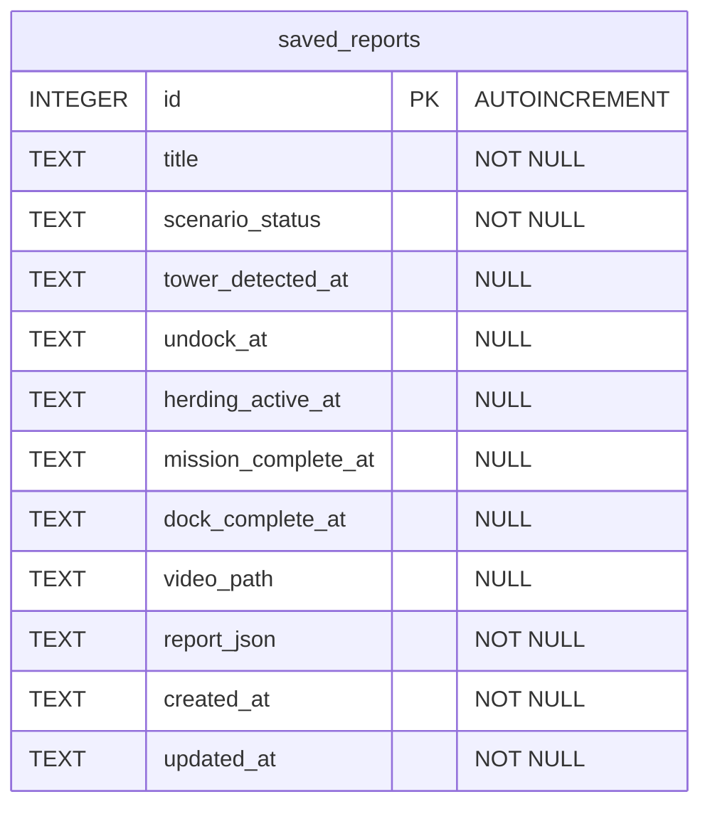

# Database ERD

이 문서는 FarmGuard UI 웹서비스의 SQLite 데이터베이스 구조를 설명합니다.

현재 DB는 저장된 통합 보고서를 관리하는 `saved_reports` 단일 테이블 구조입니다.
테이블 간 관계는 아직 없으며, 향후 이미지, AMR 위치 로그, 탐지 객체 로그 등이 추가되면 별도 테이블로 분리할 수 있습니다.

## Mermaid ERD

## Table

### saved_reports

`saved_reports`는 통합 보고서 화면에서 저장한 보고서 스냅샷을 보관하는 테이블입니다.

| Column | Type | Nullable | Description |
| --- | --- | --- | --- |
| `id` | `INTEGER` | No | 저장된 보고서 고유 ID입니다. SQLite `AUTOINCREMENT` 기본 키입니다. |
| `title` | `TEXT` | No | 사용자가 입력한 보고서 이름입니다. 입력하지 않으면 백엔드/프론트에서 기본 제목을 생성합니다. |
| `scenario_status` | `TEXT` | No | 저장 당시의 시나리오 상태입니다. |
| `tower_detected_at` | `TEXT` | Yes | `TOWER_DETECTED` 이벤트가 기록된 시간입니다. |
| `undock_at` | `TEXT` | Yes | `UNDOCK` 이벤트가 기록된 시간입니다. |
| `herding_active_at` | `TEXT` | Yes | `HERDING_ACTIVE` 이벤트가 기록된 시간입니다. |
| `mission_complete_at` | `TEXT` | Yes | `MISSION_COMPLETE` 이벤트가 기록된 시간입니다. |
| `dock_complete_at` | `TEXT` | Yes | `DOCK_COMPLETE` 이벤트가 기록된 시간입니다. |
| `video_path` | `TEXT` | Yes | 저장된 사건 영상의 로컬 mp4 경로입니다. |
| `report_json` | `TEXT` | No | 저장 당시 통합 보고서 payload 전체를 JSON 문자열로 저장합니다. |
| `created_at` | `TEXT` | No | 보고서가 최초 저장된 시간입니다. |
| `updated_at` | `TEXT` | No | 보고서가 마지막으로 수정된 시간입니다. 현재는 저장 시점과 같습니다. |

## Design Notes

- 기본 DB 파일 위치는 `backend/reports.sqlite3`입니다.
- `FARMGUARD_REPORT_DB` 환경 변수를 지정하면 SQLite 파일 위치를 변경할 수 있습니다.
- 시간 값은 UTC ISO 문자열 형태의 `TEXT`로 저장합니다.
- 개별 이벤트 시간 컬럼은 목록 요약, 검색, 정렬, 필터링 확장을 쉽게 하기 위해 둡니다.
- `report_json`은 저장 당시 보고서 전체 구조를 보존하기 위한 원본 payload 역할을 합니다.
- 현재 인덱스는 최신순 목록 조회를 위해 `created_at DESC` 기준으로 생성됩니다.
